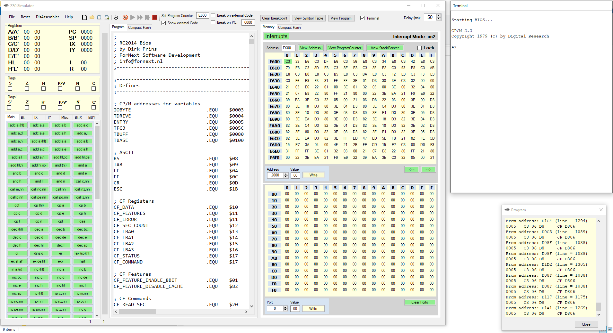
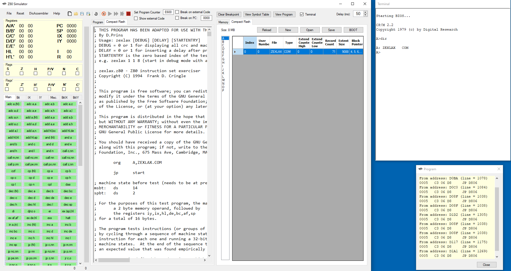
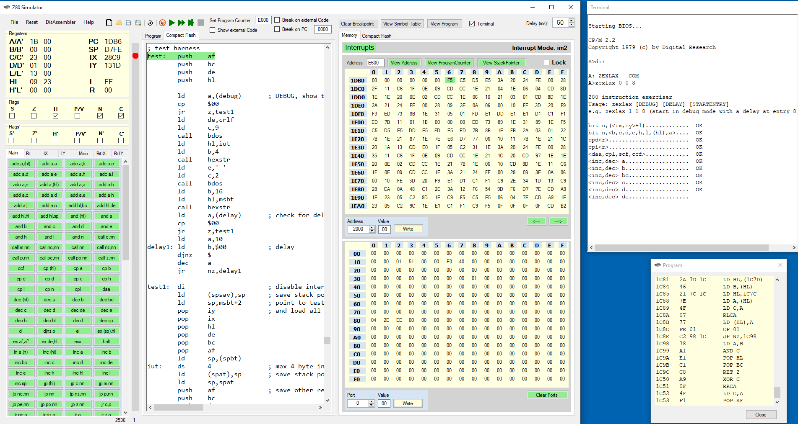
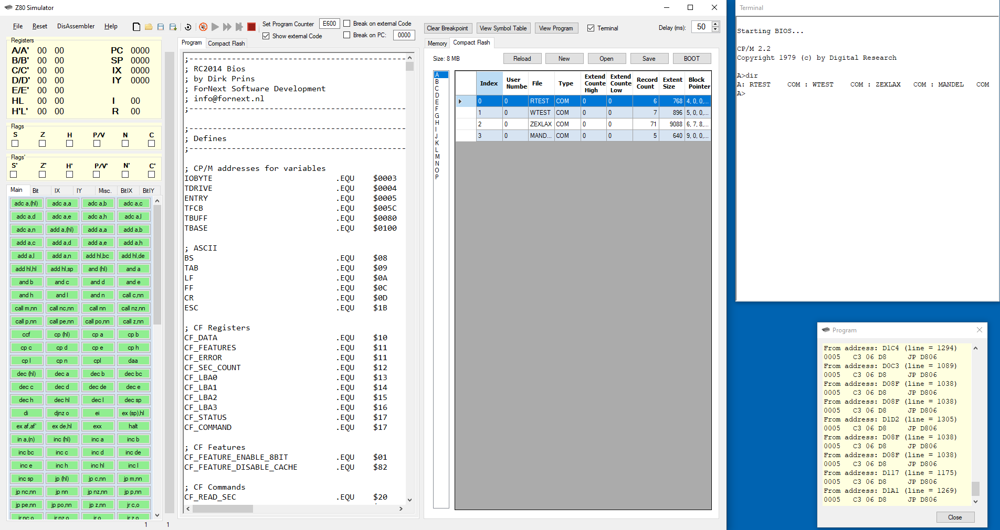
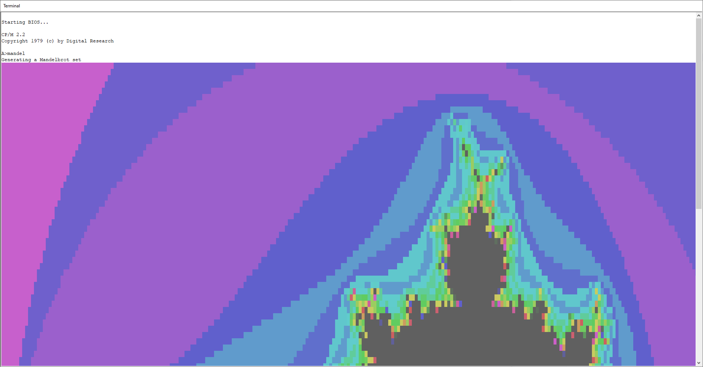

# Z80_RC2014
Z80 Assembler / Disassembler targeted at the RC2014 system

This is an assembler/disassembler for the Z80 microprocessor. 
It can also be used to debug assembler code for an RC2014 system with a SIO/2 card and Compact Flash. 

Copyright (c) 2023 Dirk Prins

You can start by loading the bios_cpm22.asm program from the folder 'Sources'.
This contains the bios and the cp/m 2.2 operating system so booting from the cf card is not needed.
Use the button 'Debug' to debug/assemble the file.
Then press the button 'Fast' (fast forward sign) to run the program.
You will then get something like:

Use the tab 'Compact Flash' next to the 'Program' tab to enter code to insert into the compact flash card.
You can use the button 'Debug' to debug/assemble the file and place it on the CF card (note the altered 'org' statement in the code):

A compact flash image is provided (zipped in the folder CompactFlash) to load in the compact flash tab page (next to the memory tab).
It contains the CP/M boot sector and some test programs (sources available in the Sources folder):
Remember when running a program you can always halt it by pressing the 'Stop' button (red square) and resume again by pressing 'Run' (play sign), 'Fast' or 'Step'. 

You could run 'mandel' (type mandel in the terminal and enter) and get the following:
(It's wise to disable the checkbox 'Show External Code' or it will take a long time)

Also provided is the Zexdoc program to test all simulated instructions:

More info is available in the 'Help' menu.

Permission is hereby granted, free of charge, to any person obtaining a copy of this software and associated documentation files (the "Software"), to deal in the Software without restriction, including without limitation the rights to use, copy, modify, merge, publish, distribute, sublicense, and/or sell copies of the Software, and to permit persons to whom the Software is furnished to do so, subject to the following conditions:

The above copyright notice and this permission notice shall be included in all copies or substantial portions of the Software.

THE SOFTWARE IS PROVIDED "AS IS", WITHOUT WARRANTY OF ANY KIND, EXPRESS OR IMPLIED, INCLUDING BUT NOT LIMITED TO THE WARRANTIES OF MERCHANTABILITY, FITNESS FOR A PARTICULAR PURPOSE AND NONINFRINGEMENT. IN NO EVENT SHALL THE AUTHORS OR COPYRIGHT HOLDERS BE LIABLE FOR ANY CLAIM, DAMAGES OR OTHER LIABILITY, WHETHER IN AN ACTION OF CONTRACT, TORT OR OTHERWISE, ARISING FROM, OUT OF OR IN CONNECTION WITH THE SOFTWARE OR THE USE OR OTHER DEALINGS IN THE SOFTWARE.
